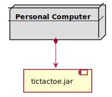
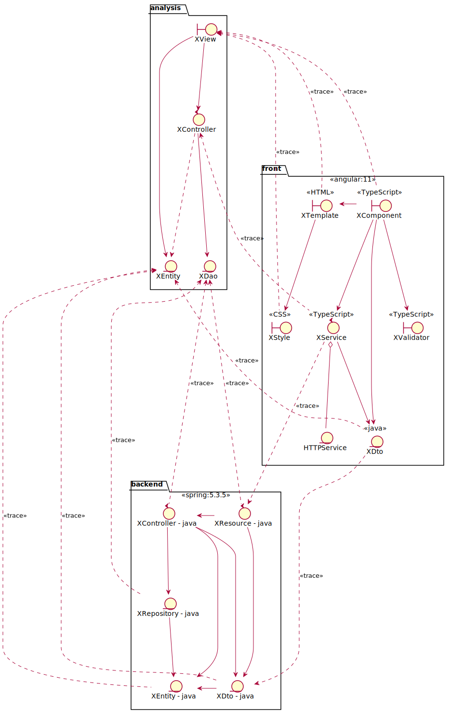

# Draughts. Requisitos Básica
Universo Santa Tecla  
[uSantaTecla@gmail.com](mailto:uSantaTecla@gmail.com)

**Índice**

1. [Analisis](#analisis)  
   1.1. [Analisis de Paquetes](#analisis-de-paquetes)  
   1.2. [Analisis de la Arquitectura](#analisis-de-la-arquitectura)  
   1.3. [Analisis de cada paquete](#analisis-de-cada-paquete)  
   1.3.1. [Vistas](#vistas)  
   1.3.2. [Controladores](#controladores)  
   1.3.3. [Modelos](#modelos)  
   1.3.3. [Tipos](#tipos)  
   1.4. [Analisis de los Casos de Uso](#analisis-de-los-casos-de-uso)  
   1.4.1. [Analisis Start](#analisis-start)  
   1.4.2. [Analisis Mover_Pieza](#analisis-move-piece)  
   1.4.3. [Analisis Resume](#analisis-resume)
2. [Diseño](#diseño)   
   2.1. [Vista de despliegue](#vista-de-despliegue)  
   2.2. [Vista de participantes](#vista-de-participantes)  
   2.3. [Vista de interacción de participantes](#vista-de-interacción-de-participantes)

## Analisis  

### Analisis de paquetes

### Analisis de la Arquitectura

### Analisis de cada paquete

#### Vistas

#### Controladores

#### Modelos

#### Tipos

### Analisis de los Casos de Uso

#### Analisis Start

#### Analisis Move Piece

#### Analisis Resume

## Diseño

### Vista de despliegue

### Vista de participantes

### Vista de interacción de participantes

